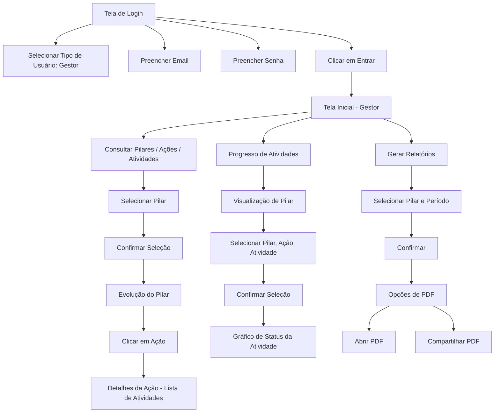
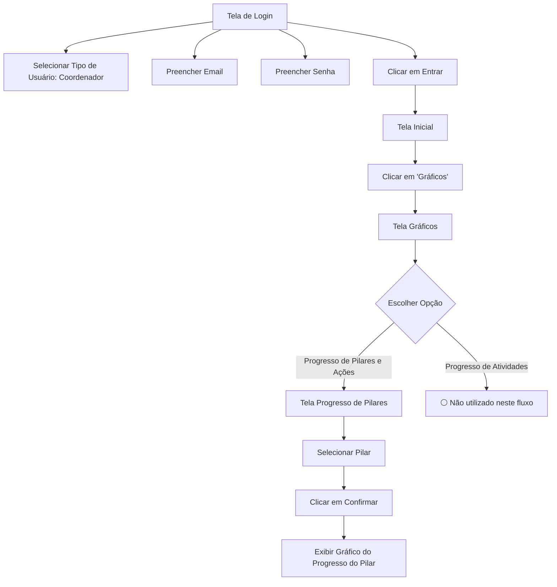
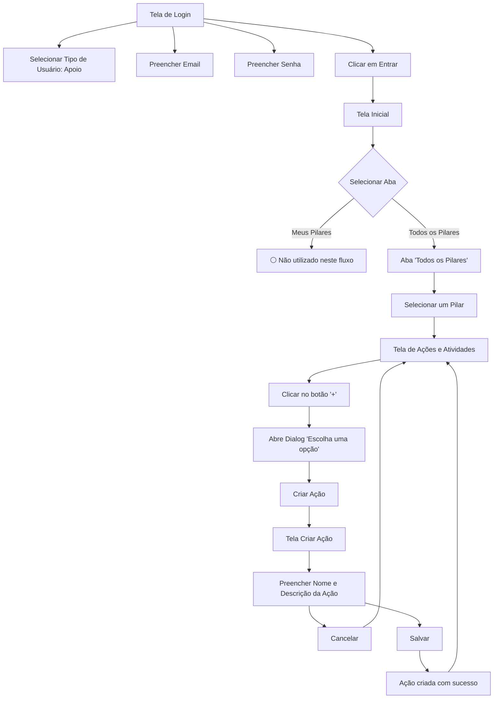

<h1 align="center" style="font-weight: bold;"> PIVOT - Projeto Android (Faculdade SENAC PE) </h1> 


## 📱 Visão Geral do App
#### Pivot é um aplicativo Android desenvolvido para facilitar o acompanhamento e a gestão de ações estratégicas, pilares e atividades dentro de instituições que adotam práticas de planejamento estratégico participativo. O app foi projetado para gestores, coordenadores e demais colaboradores que precisam visualizar o progresso de metas, emitir relatórios, acompanhar notificações e tomar decisões com base em dados.

---

## 🔑 Funcionalidades principais:
✅ Cadastro e edição de ações e atividades;

📊 Visualização de gráficos de progresso por ação, pilar ou atividade;

🧩 Organização das ações em pilares;

🔔 Notificações internas para aprovações e alterações;

📑 Geração de relatórios em PDF por período ou por pilar;

🔒 Login com autenticação para diferentes perfis de usuários (gestor, coordenador e apoio.);

🧭 Navegação por abas com ViewPager e componentes do Material Design.

---

## 🎯 Público-alvo:
### . Gestores
  Responsáveis pela visão estratégica do projeto. Tomam decisões com base em relatórios e dashboards, acompanhando o desempenho geral dos pilares, ações e atividades;

### . Coordenadores 
Atuam na linha de frente da gestão operacional. São responsáveis por aprovar, criar, editar e acompanhar ações e atividades, garantindo o alinhamento com os objetivos definidos pelos gestores;

### . Profissionais de apoio  
  Auxiliam na execução prática e no acompanhamento das ações, atividades e pilares. Possuem as mesmas permissões dos coordenadores, com exceção da função de aprovação.

---

## 🚀 Como executar
### 🔧 Pré-requisitos 

- Android Studio: versão Hedgehog 2023.1.1 ou superior

- Java JDK: versão 11

- Gradle: versão gerenciada automaticamente pelo Android Studio via gradle-wrapper.properties

#### Android SDK:

- Compile SDK: 35
- Min SDK: 24
- Target SDK: 35


### 🧩 Principais dependências
- Kotlin + AndroidX (Activity, ViewPager2, ConstraintLayout)

- MPAndroidChart para gráficos

- FlexboxLayout para layouts flexíveis

- TapTargetView para onboarding

- Lottie para animações


### 📌 Passos 
1. Clone o repositório
   ```plaintext
        git clone https://github.com/seu-usuario/Pivot.git
        cd seu-repositorio
2. Abra o projeto no Android Studio

- No Android Studio, clique em "Open"
- Selecione a pasta do projeto que você clonou
- Aguarde o Gradle sync finalizar (pode levar alguns minutos na primeira vez)


3. Configure o SDK

- Vá em File > Project Structure > SDK Location
    - Certifique-se de que o caminho do Android SDK esteja configurado corretamente
    - O JDK deve estar setado para a versão 11

4. Instale ou atualize os SDKs necessários

- Vá em Tools > SDK Manager
    - Certifique-se de que o SDK API Level 35 está instalado
    - Verifique se o Build Tools 35 está instalado

5. Crie ou use um dispositivo virtual (AVD)

- Vá em Tools > Device Manager
    - Crie um novo dispositivo virtual com Android API 24 ou superior
    - Ou conecte um dispositivo físico com Android 7.0 (API 24) ou superior

6. Execute o projeto
    - Clique no botão Run ▶️ no Android Studio
    - Escolha o dispositivo desejado (emulador ou físico)
  

   ---

## 🌳 Árvore de Diretórios

```plaintext
📁 Acoes
 ┣ 📁 Type
 ┃ ┣ AcaoComAtividadeType.kt
 ┃ ┣ PilarType.kt
 ┃ ┗ UsuarioType.kt
 ┣ AcaoPageAdapter.kt
 ┣ AcaoPageFragment.kt
 ┣ CriarAcaoActivity.kt
 ┣ CriarAtividadeActivity.kt
 ┣ EditarAcaoActivity.kt
 ┗ ListaAtividades.kt

📁 adapter
 ┣ NotificacaoAdapter.kt
 ┣ PilarAdapter.kt
 ┗ TipoNotificacao.kt

📁 apoio
 ┗ MeusPilaresApoioFragment.kt

📁 data
 ┣ DatabaseHelper.kt
 ┗ RelatorioDatabaseHelper.kt

📁 editarAtividade
 ┣ AtividadeEdit.kt
 ┗ EditarAtividadeActivity.kt

📁 editarpilar
 ┗ EditarActivity.kt

📁 fragmentpilares
 ┣ MeusPilaresFragment.kt
 ┣ TodosPilaresFragment.kt
 ┗ ViewPagerAdapter.kt

📁 model
 ┣ AcaoComProgresso.kt
 ┣ AcaoEstrategica.kt
 ┣ AtividadeDB.kt
 ┣ AtividadeDetalhe.kt
 ┣ Atividadespinner.kt
 ┣ HistoricoRelatorio.kt
 ┣ Notificacao.kt
 ┣ Pilar.kt
 ┣ PilarComProgresso.kt
 ┣ PilarItem.kt
 ┣ Pilarspinner.kt
 ┣ RelatorioPeriodo.kt
 ┗ RelatorioPilar.kt

📁 novopilar
 ┗ novo_pilar.kt

📁 ui
 ┣ CoordenadorActivity.kt
 ┣ DashboardGraficoActivity.kt
 ┣ EvolucaoAcaoActivity.kt
 ┣ EvolucaoAtividade.kt
 ┣ EvolucaoPilarActivity.kt
 ┣ GerarRelatorio.kt
 ┣ GestorActivity.kt
 ┣ GraficoEvolucaoAtividade.kt
 ┣ GraficosActivity.kt
 ┣ LoginActivity.kt
 ┣ NotificacoesActivity.kt
 ┗ PilarAcaoActivity.kt

📁 utils
 ┣ HistoricoRelatorioManager.kt
 ┣ NavigationUtils.kt
 ┣ PdfAcao.kt
 ┣ PdfAtividade.kt
 ┣ PdfPilar.kt
 ┣ PdfUsuario.kt
 ┣ RelatorioGenerator.kt
 ┗ ProgressoPilaresActivity.kt

📁 res
 ┣ 📁 color
 ┃ ┣ checkbox_tint.xml
 ┃ ┗ teal_200.xml
 ┣ 📁 drawable
 ┃ ┣ acoes.png
 ┃ ┣ background_pilar.xml
 ┃ ┣ bg_arredondado_login.xml
 ┃ ┣ bg_box_acao.xml
 ┃ ┣ bg_box_azul.xml
 ┃ ┣ bg_box_cinza.xml
 ┃ ┣ bg_box_criar_atividade.xml
 ┃ ┣ bg_box_historico.xml
 ┃ ┣ bg_button_verde.xml
 ┃ ┣ bg_card_acao.xml
 ┃ ┣ bg_card_atividade.xml
 ┃ ┣ bg_card_criar_atividade.xml
 ┃ ┣ bg_input_criar_atividade.xml
 ┃ ┣ bg_item_relatorio.xml
 ┃ ┣ bg_login.jpg
 ┃ ┣ bg_spinner_button.xml
 ┃ ┣ bg_status_green.xml
 ┃ ┣ bg_status_yellow.xml
 ┃ ┣ box_background.xml
 ┃ ┣ box_criar_pilares.xml
 ┃ ┣ circle_background.xml
 ┃ ┣ edit.png
 ┃ ┣ edit_button_background.xml
 ┃ ┣ edittext_background.xml
 ┃ ┣ edittext_focused.xml
 ┃ ┣ graficos.png
 ┃ ┣ home.png
 ┃ ┣ ic_add.xml
 ┃ ┣ ic_arrow_drop_down.png
 ┃ ┣ ic_arrow_drop_down_blue.xml
 ┃ ┣ ic_arrow_drop_up.png
 ┃ ┣ ic_arrow_right.xml
 ┃ ┣ ic_close.xml
 ┃ ┣ ic_help_outline.png
 ┃ ┣ ic_launcher_background.xml
 ┃ ┣ ic_launcher_foreground.xml
 ┃ ┣ icon_notific.png
 ┃ ┣ logo.png
 ┃ ┣ notificacao.png
 ┃ ┣ plus_circle.png
 ┃ ┣ progress_bar_custom.xml
 ┃ ┣ rounded_box.xml
 ┃ ┣ rounded_checkbox.xml
 ┃ ┣ rounded_orange.xml
 ┃ ┣ spinner_background.xml
 ┃ ┣ spinner_dropdown_background.xml
 ┃ ┗ status_button_background.xml
 ┣ 📁 layout
 ┃ ┣ activity_apoio.xml
 ┃ ┣ activity_coordenador.xml
 ┃ ┣ activity_criar_acao.xml
 ┃ ┣ activity_criar_atividade.xml
 ┃ ┣ activity_criar_pilar.xml
 ┃ ┣ activity_dashboard_grafico.xml
 ┃ ┣ activity_editar.xml
 ┃ ┣ activity_evolucao_acao.xml
 ┃ ┣ activity_evolucao_atividade.xml
 ┃ ┣ activity_evolucao_pilar.xml
 ┃ ┣ activity_gerar_relatorio.xml
 ┃ ┣ activity_gestor.xml
 ┃ ┣ activity_grafico_evolucao_atividade.xml
 ┃ ┣ activity_graficos.xml
 ┃ ┣ activity_lista_atividades.xml
 ┃ ┣ activity_login.xml
 ┃ ┣ activity_notificacoes.xml
 ┃ ┣ activity_pilar_acao.xml
 ┃ ┣ activity_progresso_pilares.xml
 ┃ ┣ autorizar_conclusao.xml
 ┃ ┣ autorizar_criacao.xml
 ┃ ┣ botao_funcao_card.xml
 ┃ ┣ confirmar_conclusao_atividade.xml
 ┃ ┣ confirmar_excluir_acao.xml
 ┃ ┣ confirmar_excluir_atividade.xml
 ┃ ┣ confirmar_excluir_pilar.xml
 ┃ ┣ confirmar_pilar.xml
 ┃ ┣ editar_acao.xml
 ┃ ┣ editar_atividade.xml
 ┃ ┣ editar_pilar.xml
 ┃ ┣ fragment_acao_page.xml
 ┃ ┣ fragment_lista_pilares.xml
 ┃ ┣ fragment_page_1.xml
 ┃ ┣ fragment_page_2.xml
 ┃ ┣ fragment_page_3.xml
 ┃ ┣ item_atividade.xml
 ┃ ┣ item_atividade_acao.xml
 ┃ ┣ item_card_acao_atividade.xml
 ┃ ┣ item_notificacao.xml
 ┃ ┣ item_notificacao_aprovar.xml
 ┃ ┣ item_pilar.xml
 ┃ ┣ item_pilar_grande.xml
 ┃ ┣ pedido_conclusao.xml
 ┃ ┣ pedido_criacao.xml
 ┃ ┣ spinner_item.xml
 ┃ ┗ spinner_item_branco.xml
 ┗ 📁 menu
 ┃ ┣ menu_coordenador.xml
 ┃ ┗ menu_toolbar.xml
 ```
 ### 📦 Descrição dos Pacotes:

#### 📌 Acoes/

Contém funcionalidades relacionadas à ações:
-  Criação, edição e visualização de ações e suas atividades 
- Tipos como AcaoComAtividadeType, PilarType e UsuarioType.

#### 📌 adapter/
- Adaptadores de listas (RecyclerView) para exibição de notificações e pilares com diferentes comportamentos e estilos visuais.

#### 📌 apoio/
- Fragmento para exibição dos pilares atribuídos ao usuário como apoio.

#### 📌 data/
- Gerenciamento de acesso e persistência dos dados no banco SQLite local da aplicação.

#### 📌 editarAtividade / editarpilar
- Contêm as telas e lógicas específicas para editar uma atividade ou pilar.

#### 📌 fragmentpilares
- Fragments usados para exibição de pilares em abas, com suporte à navegação via ViewPager.

#### 📌 model
- Modelos de dados que representam entidades da aplicação, como AcaoEstrategica, Pilar, Notificacao, Relatorio, entre outros.

#### 📌 novopilar
- Tela responsável pela criação de novos pilares estratégicos.

#### 📌 ui
- Agrupa as principais telas da aplicação: login, dashboards, gráficos de progresso, notificações e relatórios.

#### 📌 utils
Classes utilitárias para navegação, geração de PDFs, manipulação de históricos e atividades de progresso.

#### 🎨 Recursos(res/)
 - Recursos visuais e de interface da aplicação Android:
    - color: define cores e temas personalizados.
    - drawable: imagens e formas XML (fundo, botões, ícones).
    - layout: arquivos de layout XML para atividades, fragments e itens de listas.
    - menu: menus de navegação presentes nas toolbars da aplicação.
  

---

## 📚 Principais Bibliotecas e Frameworks Utilizados

| Biblioteca / Framework        | Finalidade                                                                 | Justificativa                                                                 |
|------------------------------|----------------------------------------------------------------------------|--------------------------------------------------------------------------------|
| **Android SDK**              | Base para o desenvolvimento de apps nativos Android                        | Fornece os componentes essenciais para criar interfaces, atividades e serviços |
| **SQLite (via SQLiteOpenHelper)** | Persistência local de dados                                              | Solução leve e eficaz para armazenar dados estruturados localmente             |
| **ViewPager + Fragments**    | Navegação por abas e seções                                               | Permite dividir o conteúdo em páginas reutilizáveis, melhorando a experiência do usuário |
| **RecyclerView**             | Exibição eficiente de listas e coleções                                  | Altamente performático e flexível para representar grandes conjuntos de dados  |
| **Intent e Activity Navigation** | Comunicação entre telas                                                  | Facilita o fluxo de navegação entre diferentes componentes da aplicação        |
| **Custom Adapters**          | Adaptação de dados para listas (como notificações e pilares)             | Flexibilidade para renderizar diferentes layouts e dados em tempo de execução  |
| **PDFDocument (Android)**    | Geração de relatórios em PDF                                              | Permite exportar dados de forma impressa ou compartilhável diretamente do app  |
| **ConstraintLayout**         | Layout responsivo e adaptável                                             | Mais eficiente em termos de performance e facilita o design de telas complexas |
| **Material Components**      | Componentes visuais modernos e acessíveis                                | Alinha a interface ao design system da Google para apps Android         

---

## 🧭 Fluxos de Navegação
Este projeto possui diferentes tipos de usuários, cada um com permissões e fluxos distintos dentro do sistema. Abaixo estão os diagramas de navegação principais dos usuários no sistema.

### Gestor



### Coordenador - Progresso de Pilares




### Apoio - Criação de Ação



---

## 🤝 Equipe

<table>
  <tr>
    <td align="center">
      <a href="https://github.com/LouisyRodrigues" target="_blank">
        <br>
        <sub>
          <b>Louisy Rodrigues</b>
        </sub>
      </a>
    </td>
    <td align="center">
      <a href="https://github.com/RihanCabral" target="_blank">
        <br>
        <sub>
          <b>Rihan Cabral</b>
        </sub>
      </a>
    </td>
    <td align="center">
      <a href="https://github.com/VictorLavor" target="_blank">
        <br>
        <sub>
          <b>Victor Lavor</b>
        </sub>
      </a>
    </td>
     <td align="center">
      <a href="https://github.com/AndreMaurilioDEV" target="_blank">
        <br>
        <sub>
          <b>André Maurilio</b>
        </sub>
      </a>
    </td>
     <td align="center">
      <a href="https://github.com/guilherme-jacques" target="_blank">
        <br>
        <sub>
          <b>Guilherme Jacques</b>
        </sub>
      </a>
    </td>
     <td align="center">
      <a href="https://github.com/oedumelo" target="_blank">
        <br>
        <sub>
          <b>Eduardo Melo</b>
        </sub>
      </a>
    </td>
  </tr>
</table>


